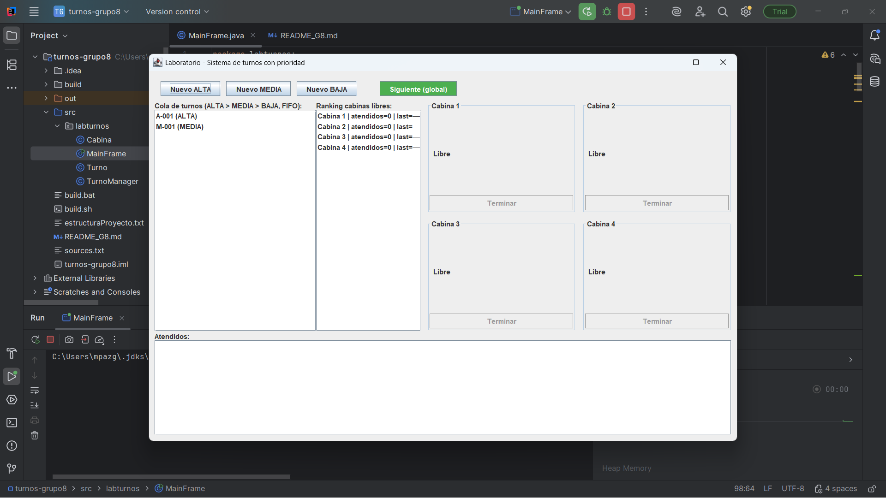
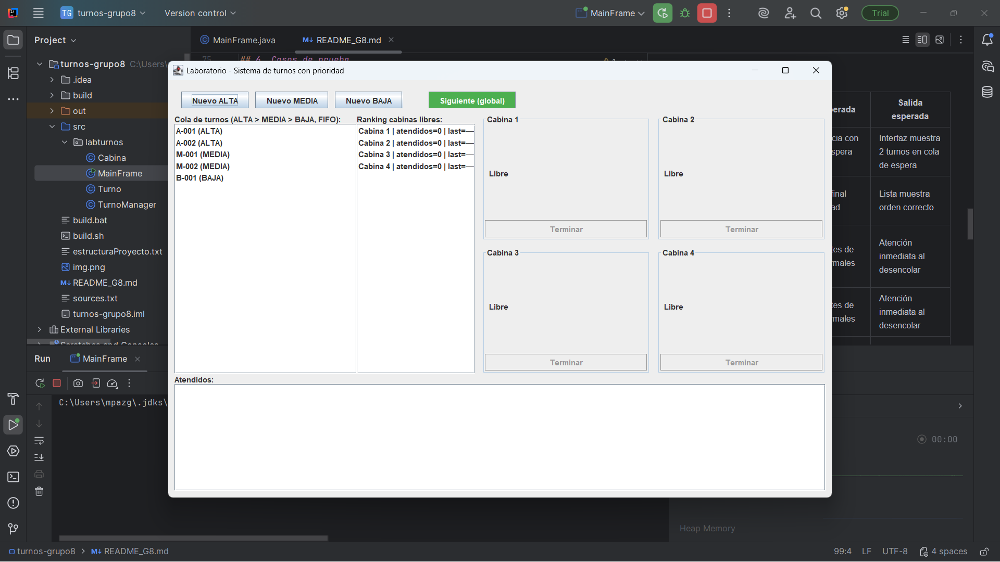
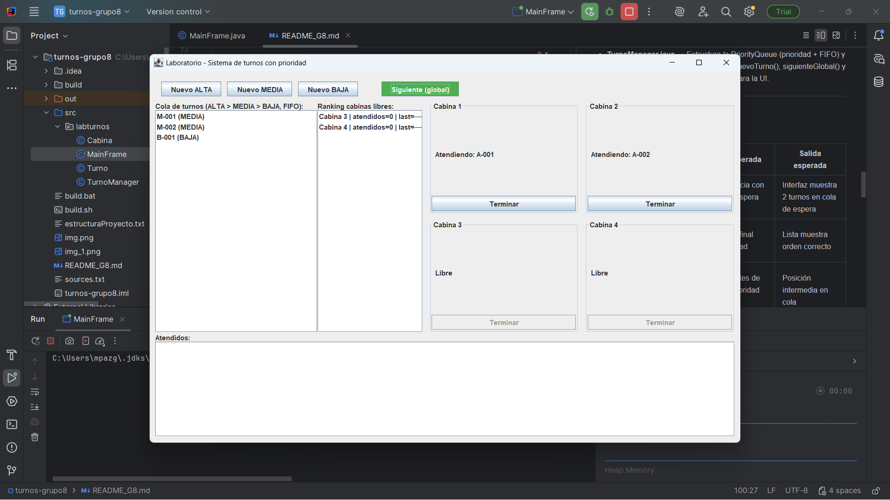
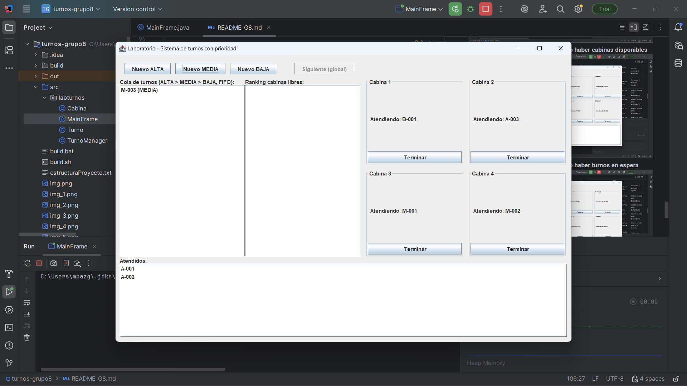
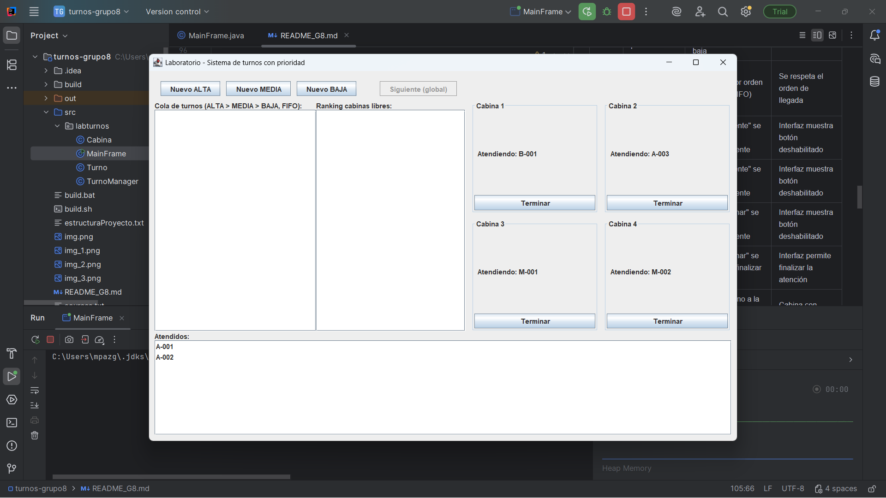
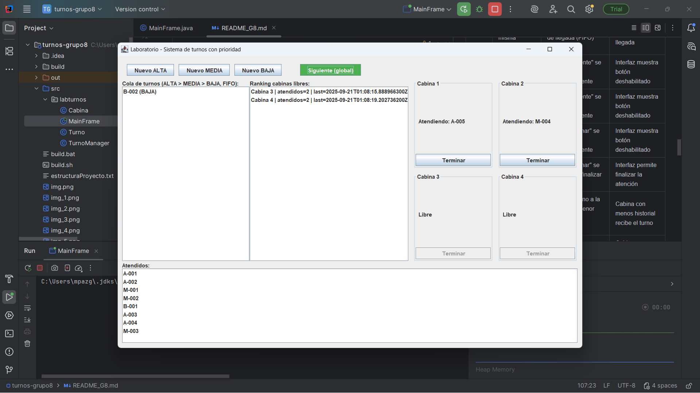
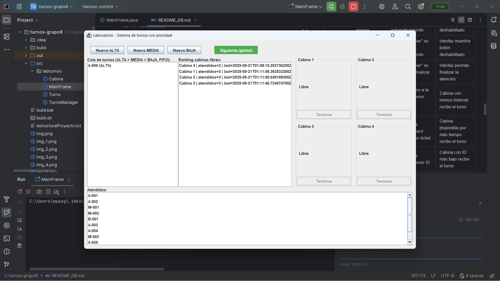
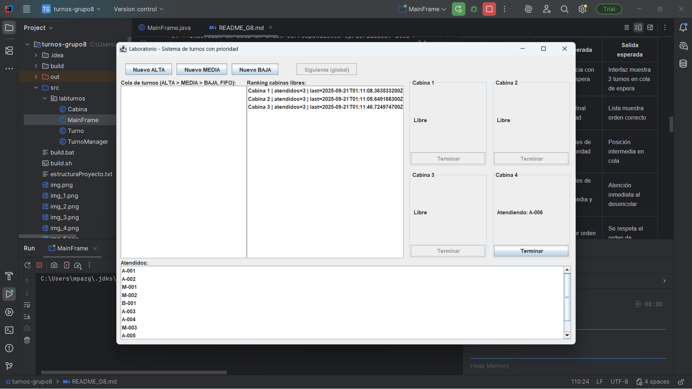
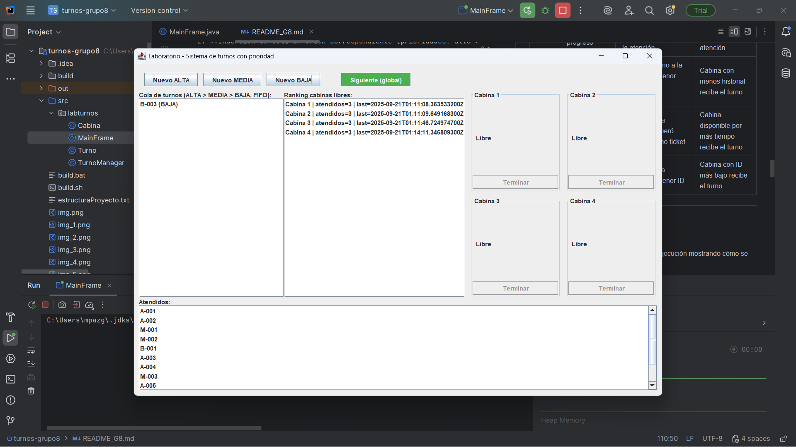
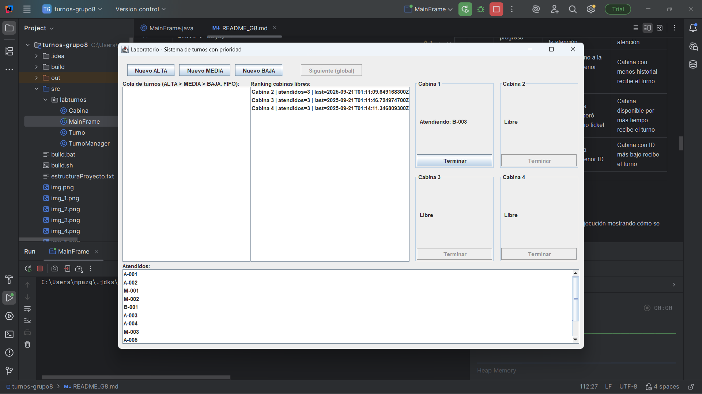

# Proyecto de Sistema de Turnos – UCOM203
A continuación se detalla el camino recorrido para poder completar este proyecto de asignación de turnos con colas de prioridad y árboles balanceados.
## 1. Información del equipo
- Grupo: G8
- Integrantes:
  - María Paz Gutiérrez – 2023371836
  - Raúl Andrés Izquierdo – 2024370697

---

## 2. Descripción del problema

Un laboratorio de exámenes médicos requiere un **sistema de turnos** que permita gestionar la atención de pacientes en 3 niveles de **preferencia** () con 4 cabinas de atención.

El sistema debe:
- Generar turnos de 3 niveles de prioridad (**BAJA, MEDIA, ALTA**).
- Administrar **4 cabinas** de atención simultánea.
- Usar **colas de prioridad** para ordenar los turnos y **árboles** para decidir qué cabina libre atiende al siguiente paciente.
- Mantener un **historial de turnos** ya atendidos.

---

## 3. Solución propuesta
Se implementa una aplicación con **Java (Swing)** que simula el sistema de turnos:
- **Cola de turnos:** Ordenada por prioridad y en caso de empate por orden de llegada (_First-In, First-Out_).
- **Ranking de asignación:** Árbol balanceado con criterios jerárquicos:
  1. Cabina con menor cantidad de turnos atendidos.
  2. Si empatan, la que liberó su último ticket más temprano.
  3. Si aún empatan, la cabina con menor ID.
- **Cabinas de atención:** Cada cabina puede estar *Libre* u *Ocupada*. Al terminar, el turno se envía al historial (_bucket_ de atendidos).
- **Interfaz gráfica (Swing):**
  - Control superior con botones para generar turnos y avanzar al siguiente.
  - Cola visible en el panel izquierdo.
  - Ranking de cabinas en panel central derecho.
  - Cabinas en panel derecho.
  - Historial de turnos atendidos en la parte inferior.

---

## 4. Instrucciones de ejecución
### Requisitos previos
- **Java 17** o superior.
- Sistema operativo: **macOS** o **Windows**.

Para compilar y ejecutar en distintos sistemas operativos:

### En macOS
```bash
cd turnos-grupo8
bash build.sh
java -jar build/libs/turnos-final.jar
```

### En Windows
```bat
cd turnos-grupo8
build.bat
java -jar build\libs\turnos-final.jar
```

---

## 5. Arquitectura del código
Se buscó separar en diferentes clases la lógica del negocio de los elementos visuales (UI). A continuación, se describen las clases principales con sus respectivas responsabilidades.

Ejemplo:
- **MainFrame.java** → Clase principal que muestra la cola, el ranking, las cabinas y los pacientes atendidos; también conecta los botones con la clase TurnoManager y refresca la vista. Centraliza eventos y no contiene lógica de negocio.
- **Cabina.java** → Modela una cabina con el turno actual, su contador de atendidos y lastFinishedAt. Expone asignar() y terminar() para cambiar su estado de forma segura.
- **Turno.java** → Representa un ticket con su id, prioridad (ALTA/MEDIA/BAJA) y seq para aplicar el FIFO de acuerdo a la prioridad de cada paciente. Es el elemento de la PriorityQueue.
- **TurnoManager.java** → Estructura la PriorityQueue<Turno> (prioridad + FIFO) y el TreeSet<Cabina> (ranking de libres). Provee nuevoTurno(), siguienteGlobal() y terminarCabina() y expone snapshots para la UI.
---

## 6. Estructura del proyecto

```
.
├── README_G8.md
├── build
│ └── libs
│     └── turnos-final.jar
├── build.bat
├── build.sh
├── src
│ └── labturnos
│     ├── Cabina.java
│     ├── MainFrame.java
│     ├── Turno.java
│     └── TurnoManager.java
└── turnos_G8.iml
```

## 7. Casos de prueba

| Caso | Entrada                               | Acción esperada                                             | Salida esperada                                  |
|------|---------------------------------------|-------------------------------------------------------------|--------------------------------------------------|
| 1    | Estado inicial del programa	      | El sistema inicia con 2 turnos en espera en la cola	        | Interfaz muestra 2 turnos en cola de espera      |
| 2    | Insertar paciente prioridad baja      | Se encola al final según prioridad                          | Lista muestra orden correcto                     |
| 3    | Insertar paciente con prioridad media | Se coloca antes de pacientes prioridad baja                 | Posición intermedia en cola                      |
| 4    | Insertar paciente con prioridad alta  | Se coloca antes de pacientes prioridades media y baja       | Atención inmediata al desencolar                 |
| 5    | Dos pacientes con misma prioridad     | Se atiende por orden de llegada (FIFO)                      | Se respeta el orden de llegada                   |
| 6    | No hay cabinas disponibles            | Botón "Siguiente" se deshabilita automáticamente            | Interfaz muestra botón deshabilitado             |
| 7    | No hay turnos en espera               | Botón "Siguiente" se deshabilita automáticamente            | Interfaz muestra botón deshabilitado             |
| 8    | Ningún turno en progreso              | Botón "Terminar" se deshabilita automáticamente             | Interfaz muestra botón deshabilitado             |
| 9    | Turno en progreso                     | Botón "Terminar" se habilita para finalizar la atención     | Interfaz permite finalizar la atención           |
| 10   | Asignación a cabinas (menos atendidos)| Se asigna turno a la cabina con menor cantidad de atendidos | Cabina con menos historial recibe el turno       |
| 11   | Empate en cantidad de atendidos       | Se asigna a la cabina que liberó antes su último ticket     | Cabina disponible por más tiempo recibe el turno |

---

## 8. Resultados
A continuación, se encuentran evidenciados resultados logrados con capturas de pantalla.

### En sistema operativo Windows
1. **Estado inicial con dos turnos ya en cola**
   
2. **Inserción en cola en orden correspondiente (prioridades: alta > media > baja)**
   
3. **Dos pacientes con misma prioridad juntos en la cola**
   
4. **Botón "Siguiente" deshabilitado al no haber cabinas disponibles**
   
5. **Botón "Siguiente" deshabilitado al no haber turnos en espera**
   
6. **Botón "Terminar" deshabilitado en cabinas sin turno en progreso y habilitado en cabinas con turno en progreso**
   
7. **Asignación de paciente a cabina con menos atendidos (en este caso, a la 4)**
    
8. **Al haber empate de atendidos, asignación de paciente a cabina con mayor tiempo de descanso (en este caso, la 1)**
    

---

## 9. Lecciones aprendidas

- Uno de los aspectos más desafiantes realmente fue la **compilación en diferentes sistemas operativos** sin realizar modificaciones a los archivos (scripts).
- Modelar una **cola** con `PriorityQueue` **usando comparador** (ALTA>MEDIA>BAJA y FIFO por seq) y a balancear cabinas con un `TreeSet` ordenado serían nuestros principales aprendizajes, tanto de estructuras de datos como de **colas de prioridad**.
- Añadir **persistencia al historial**, agregar **métricas**, **pulir** más la **interfaz** serían nuestros principales puntos de atención al momento de realizar **mejoras** con mayor tiempo.

---

## 10. Referencias
- Documentación oficial de [Java PriorityQueue](https://docs.oracle.com/javase/8/docs/api/java/util/PriorityQueue.html)
- Documentación oficial de [Java TreeSet](https://docs.oracle.com/javase/8/docs/api/java/util/TreeSet.html)
- Apuntes de clase: *Estructura de Datos – MSc. Lessette Zambrano Zurita*
